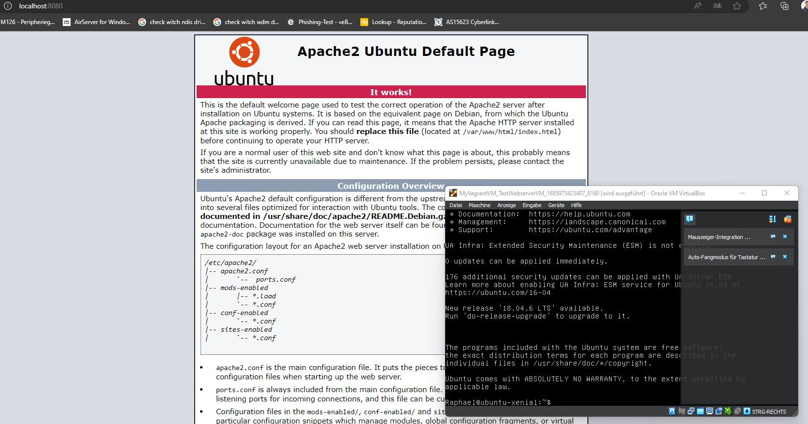
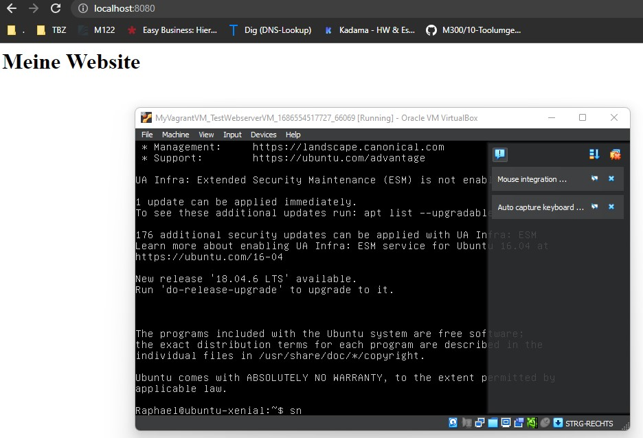

M300 - 20 Mein Vorgehen
=======================================

Diese Wikiseite zeigt mein Vorgehen bei der Erstellung von Vagrant files um die erstellung von VM's zu Automatisieren.

#### Vorgehen mit Vagrant

1. Erstellen eines Ordners, in dem das Vagrant file gespeichert werden soll
2. In diesem Ordner öffnen wir nun die Git bash Konsole
3.  Als nächstes möchten wir mit folgendem Befehl, eine Vagrant Box erstellen. Vagrant Boxen sind vordefinierte virtuelle Maschinen. In diesem Fall wird die Vagrant Box "ubuntu/xenial64" verwendet. Man kann diese Box auch in der Vagrant Cloud finden.
    ```Shell
       $  vagrant init ubuntu/xenial64
    ```

4. Nun möchten wie den Erstellungsprozess mit folgendem Befehl starten. Dass Image wird nun aus dem Internet heruntergeladen, sovern es noch nicht lokal auf dem Rechner ist. Dabei werden alle im Vagrant file konfigurierten Einstellungen berücksichtigt.
   
    ```Shell
       $  vagrant up --provider virtualbox
    ```

5. Wenn die VM erstellt ist, kann man sich mit folgendem Befehl per SSH auf die VM verbinden
    ```Shell
       $  vagrant ssh
    ```

Folgend sind wichtige Befehle im Zusammenhang mit Vagrant


| Befehl                    | Beschreibung                                                      |
| ------------------------- | ----------------------------------------------------------------- | 
| `vagrant init`            | Initialisiert im aktuellen Verzeichnis eine Vagrant-Umgebung und erstellt, falls nicht vorhanden, ein Vagrantfile |
| `vagrant up`              |  Erzeugt und Konfiguriert eine neue Virtuelle Maschine, basierend auf dem Vagrantfile |
| `vagrant ssh`             | Baut eine SSH-Verbindung zur gewünschten VM auf                   |
| `vagrant status`          | Zeigt den aktuellen Status der VM an                              |
| `vagrant port`            | Zeigt die Weitergeleiteten Ports der VM an                        |
| `vagrant halt`            | Stoppt die laufende Virtuelle Maschine                            |
| `vagrant destroy`         | Stoppt die Virtuelle Maschine und zerstört sie.                   |


#### Erste angepasste VM mit Vagrant
Ich habe nun das Vagrant file angepasst, damit ein Webserver installiert wird, mit einer Blanken Website. Dies ist im ersten Bild zusehen. Danach habe ich das Vagrant fiel weiterangepasst, dass auch etwas auf der Website angezeigt wird. Dies ist im zweiten Bild zu sehen.



### Netzwerkplan
Hier ein vereinfachter Netzwerkplan
