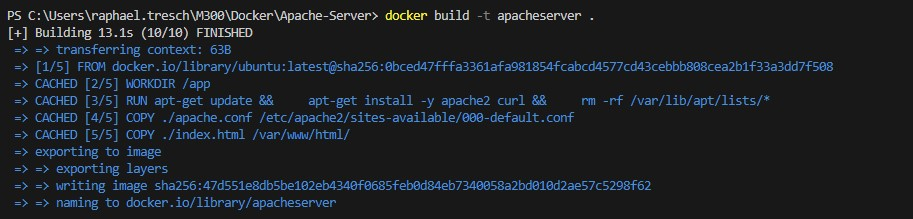
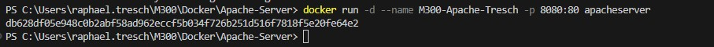
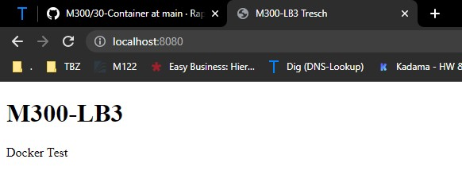

### Apache Server

Dieses Dockerfile erstellt einen Container, der einen Apache-Webserver und eine HTML-Seite bereitstellt. Der Benutzer kann über einen Webbrowser auf diese Anwendung zugreifen und die HTML-Seite mit der Nachricht "Das ist ein Test" anzeigen lassen.

### Dockerfile
Das Dockerfile basiert auf dem neuesten Ubuntu-Basisimage. Zunächst wird der Apache-Webserver und das curl-Programm installiert. Anschließend wird die Konfigurationsdatei des Apache-Servers aktualisiert und die index.html-Datei in das Verzeichnis /var/www/html kopiert. Der Container wird auf Port 8081 freigegeben. Schließlich wird der Befehl zum Starten des Apache-Servers definiert.

```Script
RUN apt-get update && \
    apt-get install -y apache2 curl && \
    rm -rf /var/lib/apt/lists/*

COPY ./apache.conf /etc/apache2/sites-available/000-default.conf

COPY ./index.html /var/www/html/
```

### apache.conf

Die apache.conf-Datei enthält die grundlegenden Konfigurationseinstellungen für den Apache-Webserver. Hier wird der Servername auf "localhost" und das Dokumentenverzeichnis auf "/var/www/html" festgelegt. Zusätzlich werden die Berechtigungen für das Verzeichnis definiert, damit der Apache-Server auf die Dateien zugreifen und sie bereitstellen kann.

### index.html
Die index.html-Datei ist eine statische HTML-Seite, die im Verzeichnis /var/www/html des Apache-Webservers platziert wird. Sie besteht aus einer einfachen HTML-Struktur mit einem Titel "M300-LB3" und einem Absatztext "Das ist ein Test". Nach dem Starten des Apache-Webservers kann diese Seite im Webbrowser über die Adresse "localhost:8081" aufgerufen werden.

### Ablauf Installation
## Erstelle ein Image

```Script
docker build -t mein-image .
```


## Erstelle ein Container

```Script
docker run -d --name mein-container -p 8080:80 mein-image
```


### Kontrolle

Kontrollieren muss man natürlich auch, ob die Website funktioniert, folgend der Beweis und die Testfälle


### Testprotokoll
| Nr | Testfall | Erwartetes Ergebnis | Tatsägchliches Ergebnis | Abgenommen? |
| -------- | -------- | -------- | -------- | -------- |
| 1 | Website ist unter  | http://localhost:8080 erreichbar | Website ist erreichbar | Ja |
| 2 | Replizierbarkeit | Gleiches file kann auf meinem Privaten PC gestartet werden | Wird auf Privatem PC gestartet | Ja |