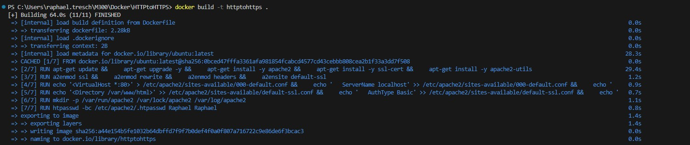
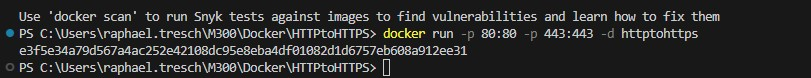
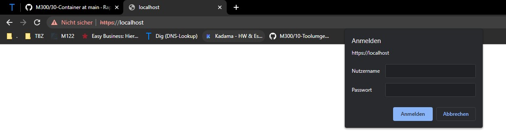
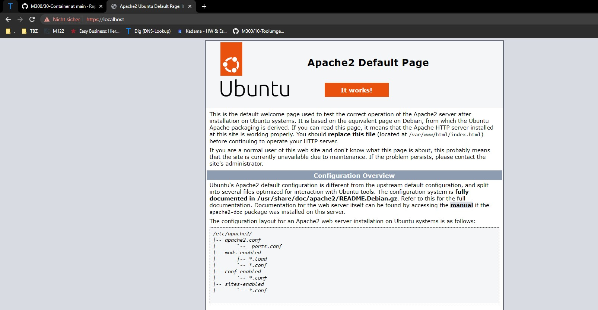

### HTTP to HTTPS

Dieses Dockerfile erstellt ein Docker-Image, das den Apache-Webserver mit aktiviertem SSL-Modul und Basis-Authentifizierung verwendet. Der Apache-Webserver wird im Vordergrund gestartet, und die Ports 80 und 443 werden freigegeben.

### Vorgang
1. Verwende das aktuellste offizielle Ubuntu-Image als Basis.
2. Setze den Ersteller des Images auf Apache.
3. Installiere den Apache-Webserver, SSL-Zertifikate und apache2-utils.
4. Aktiviere erforderliche Apache-Module (ssl, rewrite, headers) und die Standard-Site für SSL.
5. Erstelle eine Umleitung von Port 80 auf 443 in einer Konfigurationsdatei mit der Erweiterung .conf.
6. Füge die Anweisungen zur Authentifizierung zur SSL-Konfigurationsdatei hinzu.
7. Setze die Umgebungsvariablen für Apache.
8. Erstelle die erforderlichen Verzeichnisse für Apache.
9. Erstelle eine .htpasswd-Datei mit Basis-Authentifizierung.
10. Öffne die Ports 80 und 443 nach außen.
11. Starte den Apache-Webserver im Vordergrund.

### Verwendung 
Das erstellte Docker-Image kann verwendet werden, um einen Apache-Webserver mit SSL-Unterstützung und Basis-Authentifizierung in einem Docker-Container bereitzustellen. Die Ports 80 und 443 müssen freigegeben sein, damit der Container von außen erreichbar ist.

Code für die Umleitung von HTTP zu HTTPS:

```Script
RUN echo '<VirtualHost *:80>' > /etc/apache2/sites-available/000-default.conf && \
    echo '   ServerName localhost' >> /etc/apache2/sites-available/000-default.conf && \
    echo '   Redirect permanent / https://localhost/' >> /etc/apache2/sites-available/000-default.conf && \
    echo '</VirtualHost>' >> /etc/apache2/sites-available/000-default.conf
```

Code für die Authentifizierung:
```Script
RUN echo '<Directory /var/www/html>' >> /etc/apache2/sites-available/default-ssl.conf && \
    echo '   AuthType Basic' >> /etc/apache2/sites-available/default-ssl.conf && \
    echo '   AuthName "Restricted Content"' >> /etc/apache2/sites-available/default-ssl.conf && \
    echo '   AuthUserFile /etc/apache2/.htpasswd' >> /etc/apache2/sites-available/default-ssl.conf && \
    echo '   Require valid-user' >> /etc/apache2/sites-available/default-ssl.conf && \
    echo '</Directory>' >> /etc/apache2/sites-available/default-ssl.conf
```

### Ablauf Installation
## Erstelle ein Image

```Script
docker build -t httptohttps .
```


## Erstelle ein Container

```Script
docker run -p 80:80 -p 443:443 -d httptohttps
```


### Kontrolle

Kontrollieren muss man natürlich auch, ob die Website funktioniert und auch als HTTPS angezeigt wird mit Authentifizierung, folgend der Beweis und die Testfälle



### Testprotokoll
| Nr | Testfall | Erwartetes Ergebnis | Tatsächliches Ergebnis | Abgenommen? |
| -------- | -------- | -------- | -------- | -------- |
| 1 | Funktionalität | Website ist unter http://localhost erreichbar | Website ist erreichbar | Ja |
| 2 | Funktionalität | Beim Aufrufen der Website kommt ein Anmeldefenster| Anmeldefenster erscheint | Ja |
| 3 | Funktionalität | Eingabe BN und PW erfolgreich und website wird angezeigt | Nach BN und PW eingabe, wird die Website angezeigt| Ja |
| 4 | Replizierbarkeit | Gleiches file kann auf meinem Privaten PC gestartet werden | Wird auf Privatem PC gestartet | Ja |