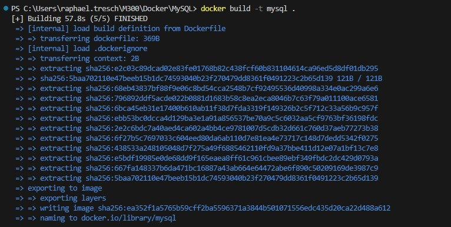
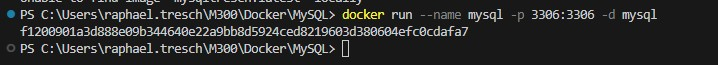
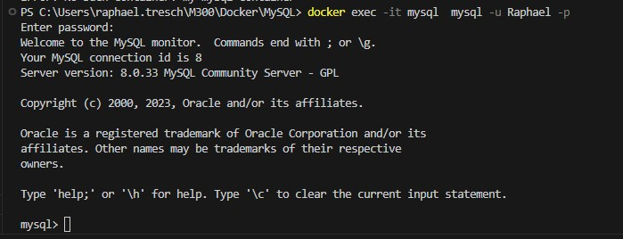

### MySQL

Dieses Dockerfile erstellt ein Image für einen MySQL-Server mit vordefinierten Benutzer- und Datenbankinformationen.

### Infos
Das Dockerfile basiert auf dem offiziellen MySQL-Image, das über Docker Hub verfügbar ist. Es wird eine MySQL-Datenbank namens "mydatabase" erstellt und ein Benutzer mit den Zugangsdaten "Raphael:Raphael" angelegt. Der MySQL-Server wird auf Port 3306 freigegeben und startet automatisch, wenn der Docker-Container gestartet wird.

### MySQL Datenbank und Benutzer erstellen
Um eine MySQL-Datenbank und einen Benutzer zu erstellen, werden Umgebungsvariablen verwendet:
```Script
ENV MYSQL_DATABASE mydatabase

ENV MYSQL_USER Raphael
ENV MYSQL_PASSWORD Raphael
EXPOSE 3306
```

Code für die Authentifizierung:
```Script
RUN echo '<Directory /var/www/html>' >> /etc/apache2/sites-available/default-ssl.conf && \
    echo '   AuthType Basic' >> /etc/apache2/sites-available/default-ssl.conf && \
    echo '   AuthName "Restricted Content"' >> /etc/apache2/sites-available/default-ssl.conf && \
    echo '   AuthUserFile /etc/apache2/.htpasswd' >> /etc/apache2/sites-available/default-ssl.conf && \
    echo '   Require valid-user' >> /etc/apache2/sites-available/default-ssl.conf && \
    echo '</Directory>' >> /etc/apache2/sites-available/default-ssl.conf
```

### Ablauf Installation
## Erstelle ein Image

```Script
docker build -t mysql .
```

## Erstelle ein Container

```Script
docker run --name mysql -p 3306:3306 -d mysql
```


### Kontrolle

Um zu kontrollieren, ob die Verbindung zu MySQL funktioniert, kann man folgenden befehl ausführen.
```Script
docker exec -it my-mysql-container mysql -u user -p
```
Nach der PW eingabe sollte es wie folgt ausehen


### Testprotokoll
| Nr | Testfall | Erwartetes Ergebnis | Tatsächliches Ergebnis | Abgenommen? |
| -------- | -------- | -------- | -------- | -------- |
| 1 | Funktionalität | Man kann sich über einen Befhel auf die DB verbinden | Es kann sich verbunden werden | Ja |
| 2 | Funktionalität | PW kann eingegeben werden und wird akzeptiert | PW wird akzeptiert | Ja |
| 3 | Funktionalität | Nach PW eingabe wird Verbindung angezeigt | Verbindung wird angezeigt| Ja |
| 4 | Replizierbarkeit | Gleiches file kann auf meinem Privaten PC gestartet werden | Wird auf Privatem PC gestartet | Ja |