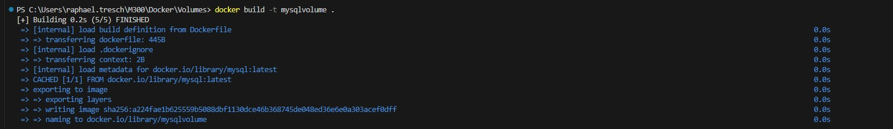
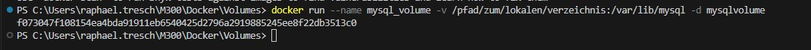
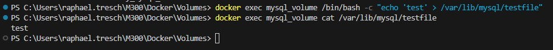

### Volumes

Volumes in Docker bieten die Möglichkeit, Daten zwischen Containern auszutauschen und persistent zu speichern. Sie ermöglichen die Speicherung von Daten über die Lebensdauer von Containern hinweg und bieten Flexibilität bei der Verwaltung von Daten in einem Container-Cluster.

### Wieso werden Volumes verwendet
Durch die Verwendung von Volumes können Daten zwischen Containern ausgetauscht und persistent gespeichert werden. Dies ermöglicht es, Daten auf einfache Weise in einem Container-Cluster zu teilen und zu skalieren. Volumes bieten eine effiziente und flexible Methode, um Daten in Docker-Anwendungen zu verwalten.

### Code zum erstellen eines Volumes
```Script
VOLUME /var/lib/mysql
```
Dieser Code erstellt ein Volume mit dem Pfad /var/lib/mysql. Dadurch wird ein separater Speicherbereich für die MySQL-Daten innerhalb des Containers erstellt.

### Ablauf Installation
## Erstelle ein Image

```Script
docker build -t mysqlvolume .
```

## Erstelle ein Container

```Script
docker run --name mysql_volume -v /pfad/zum/lokalen/verzeichnis:/var/lib/mysql -d mysqlvolume
```


### Kontrolle

Um zu Testen, ob das Volume funktioniert und verbunden werden kann, dazu erstellen wir zuerst ein Volume
```Script
docker exec mysql_volume /bin/bash -c "echo 'test' > /var/lib/mysql/testfile"
```
Nun Schauen wir mit folgendem Befehl, was in dem Volume enthalten ist
```Script
docker exec mysql_volume cat /var/lib/mysql/testfile
```


### Testprotokoll
| Nr | Testfall | Erwartetes Ergebnis | Tatsächliches Ergebnis | Abgenommen? |
| -------- | -------- | -------- | -------- | -------- |
| 1 | Funktionalität | Image und Container kann erstellt werden | Image und Container wird erstellt | Ja |
| 2 | Funktionalität | Datei kann im Volume erstellt werden | Datei wird in Volume erstellt | Ja |
| 3 | Funktionalität | Datei kann in Volume angezeigt werden | Datei wird in Volume angezeigt | Ja |
| 4 | Replizierbarkeit | Gleiches file kann auf meinem Privaten PC gestartet werden | Wird auf Privatem PC gestartet | Ja |