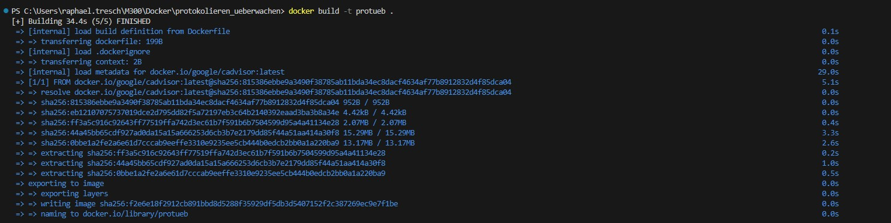
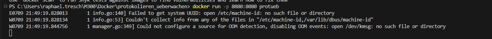
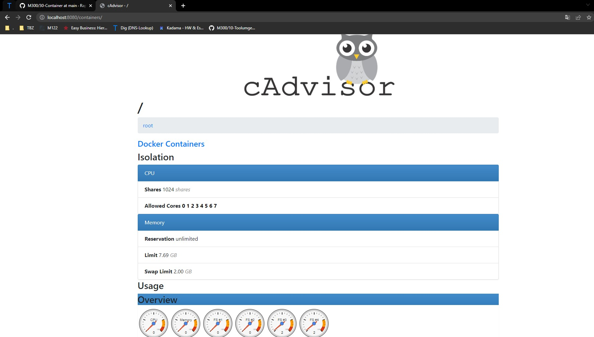

### Protokollierung und Überwachung

Dieses Dockerfile basiert auf dem Image von google/cadvisor und stellt cAdvisor in einem Container bereit. Durch Freigabe des Ports 8080 wird der Zugriff auf die cAdvisor-Web-Schnittstelle ermöglicht. Der Befehl CMD startet cAdvisor mit den Optionen --logtostderr und --port=8080.

### Code im Dockerfile zur Startkonfiguration von cAdvisor
Der folgende Code im Dockerfile startet cAdvisor mit den angegebenen Konfigurationsoptionen:
```Script
CMD ["/usr/bin/cadvisor", "--logtostderr", "--port=8080"]
```
Dieser Befehl definiert den auszuführenden Befehl im Container. Hier wird der Pfad /usr/bin/cadvisor verwendet, um cAdvisor auszuführen. Die Option --logtostderr bewirkt, dass die Protokollierung an die Standardausgabe umgeleitet wird. Die Option --port=8080 gibt den Port 8080 für den cAdvisor-Dienst frei, so dass auf die Web-Schnittstelle zugegriffen werden kann.

Durch die Verwendung dieses Dockerfiles und die Konfiguration des CMD-Befehls wird cAdvisor im Container gestartet und ermöglicht das Protokollieren und Überwachen von Ressourceninformationen. Die cAdvisor-Web-Schnittstelle ist über den Port 8080 erreichbar.

### Ablauf Installation
## Erstelle ein Image

```Script
docker build -t protueb .
```

## Erstelle ein Container

```Script
docker run -p 8080:8080 protueb
```


### Kontrolle

Um nun auch sicher zu gehen, dass die Website erreichbar ist, werden wir  http://localhost:8080 versuchen zu öffnen



### Testprotokoll
| Nr | Testfall | Erwartetes Ergebnis | Tatsägchliches Ergebnis | Abgenommen? |
| -------- | -------- | -------- | -------- | -------- |
| 1 | Funktionalität | Es wird ein Docker Image erstellt | Es wird ein Docker Image erstellt  | Ja |
| 2 | Funktionalität | Es wird ein Container erstellt | Es wird ein Container erstellt | Ja |
| 3 | Funktionalität | Man kann die Lokalhost adresse unter https://localhost erreichen | Man kann die Lokalhost adresse unter https://localhost erreichen | Ja |
| 4 | Replizierbarkeit | Gleiches file kann auf meinem Privaten PC gestartet werden | Wird auf Privatem PC gestartet | Ja |