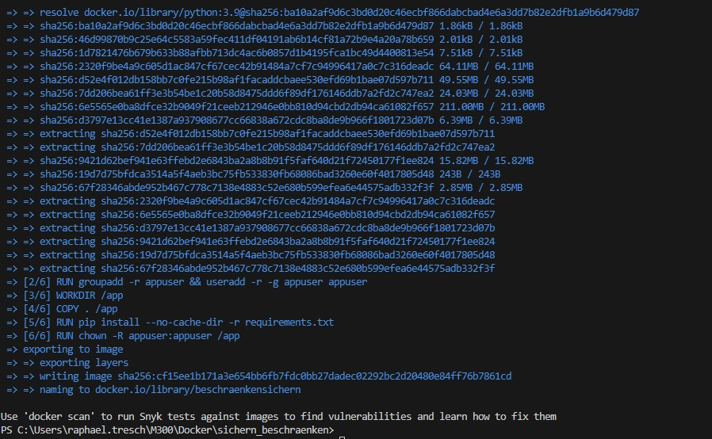
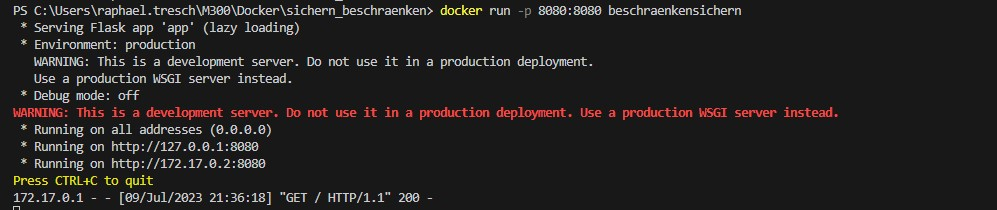
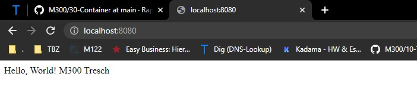

### Sicherung und Beschränkung des Containers

Um die Sicherheit des Containers zu gewährleisten, wird in diesem Dockerfile ein schlankes Python-3.9-Basisimage verwendet, um die Größe des Containers zu minimieren und die Angriffsfläche zu reduzieren. Darüber hinaus werden Berechtigungen eingeschränkt, indem ein eigener Benutzer erstellt wird und eine requirements.txt-Datei verwendet wird, um die erforderlichen Python-Abhängigkeiten zu installieren. Dies trägt dazu bei, die Angriffsfläche weiter zu minimieren und die Sicherheit der Anwendung zu erhöhen

### Wichtige Befehle im Dockerfile
```Script
RUN groupadd -r appuser && useradd -r -g appuser appuser

RUN pip install --no-cache-dir -r requirements.txt

RUN chown -R appuser:appuser /app
USER appuser

CMD ["python", "app.py"]
```
Die ersten beiden Befehle erstellen einen eigenen Benutzer (appuser), der für die Ausführung der Anwendung im Container verwendet wird. Dadurch werden die Berechtigungen eingeschränkt und die Sicherheit erhöht. Anschließend werden die Python-Abhängigkeiten aus der requirements.txt-Datei installiert, um sicherzustellen, dass die Anwendung ordnungsgemäß funktioniert.

Der Befehl chown weist den Eigentümer und die Gruppe des Verzeichnisses /app dem Benutzer appuser zu, um sicherzustellen, dass der Benutzer nur die erforderlichen Berechtigungen hat und nicht auf andere Dateien oder Verzeichnisse zugreifen kann.

Mit dem Befehl USER wird der Benutzer auf appuser geändert, um sicherzustellen, dass die Anwendung mit den eingeschränkten Berechtigungen des Benutzers ausgeführt wird.

Schließlich wird der Befehl CMD verwendet, um die Anwendung app.py mit dem Python-Interpreter zu starten.

### app.py-Datei zur Darstellung einer Test-Website
Die app.py-Datei enthält den Code zur Erstellung einer einfachen Test-Website mit Flask. Beim Aufruf der Wurzel-URL wird die Nachricht "Hello, World!" zurückgegeben. Durch das Ausführen dieser Datei wird der Webserver gestartet und die Website bereitgestellt.
```Script
from flask import Flask

app = Flask(__name__)

@app.route('/')
def hello():
    return "Hello, World! M300 Tresch"

if __name__ == '__main__':
    app.run(host='0.0.0.0', port=8080)
```
Dieser Code stellt eine grundlegende Flask-Anwendung bereit, die den Flask-Webserver verwendet, um eine Test-Website bereitzustellen. Beim Aufrufen der Wurzel-URL wird die definierte Nachricht zurückgegeben. Die Anwendung wird auf dem Host 0.0.0.0 und dem Port 8080 gestartet.

Durch die Kombination dieser Sicherheitsmaßnahmen, wie der Verwendung eines schlanken Basisimages, der Einschränkung der Berechtigungen und der Verwendung eines eigenen Benutzers, wird die Sicherheit des Containers verbessert und die Angriffsfläche minimiert.

### Ablauf Installation
## Erstelle ein Image

```Script
docker build -t beschraenkensichern .
```

## Erstelle ein Container

```Script
docker run -p 8080:8080 beschraenkensichern
```


### Kontrolle

Um nun auch sicher zu gehen, dass die Website erreichbar ist, werden wir  http://localhost:8080 versuchen zu öffnen



### Testprotokoll
| Nr | Testfall | Erwartetes Ergebnis | Tatsägchliches Ergebnis | Abgenommen? |
| -------- | -------- | -------- | -------- | -------- |
| 1 | Funktionalität | Es wird ein Docker Image erstellt | Es wird ein Docker Image erstellt  | Ja |
| 2 | Funktionalität | Es wird ein Container erstellt | Es wird ein Container erstellt | Ja |
| 3 | Funktionalität | Man kann die Lokalhost adresse unter https://localhost erreichen | Man kann die Lokalhost adresse unter https://localhost erreichen | Ja |
| 4 | Replizierbarkeit | Gleiches file kann auf meinem Privaten PC gestartet werden | Wird auf Privatem PC gestartet | Ja |