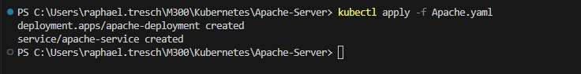
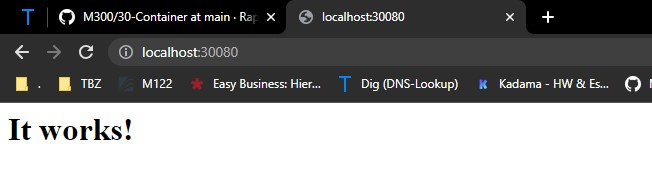
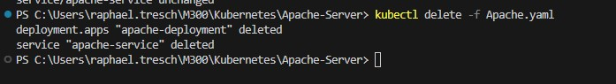

### Apache-Server in Kubernetes

Die vorliegende .yaml-Datei enthält eine Konfiguration für ein Kubernetes-Deployment und einen Service, um eine Apache-Webanwendung bereitzustellen. Das Deployment verwendet das httpd:latest-Image und läuft auf Port 80 mit dem Label app: apache. Der Service leitet den eingehenden Traffic auf Port 80 an das Deployment weiter und öffnet einen Node-Port auf 30080.

### Konfiguration der .yaml-Datei
Die .yaml-Datei enthält die Konfiguration für das Kubernetes-Deployment und den Service für den Apache-Server. Dabei werden die folgenden Parameter definiert:

Deployment: Es wird das httpd:latest-Image verwendet, um den Apache-Server bereitzustellen. Der Server läuft auf Port 80 und wird mit dem Label app: apache gekennzeichnet.
Service: Der Service leitet den eingehenden Traffic auf Port 80 an das Deployment weiter. Zusätzlich wird ein Node-Port auf 30080 geöffnet, der den Zugriff von außen ermöglicht.
Durch die Bereitstellung dieser .yaml-Datei in Kubernetes wird der Apache-Server gestartet und der eingehende Traffic auf Port 80 an den Server weitergeleitet. Der Service öffnet den Node-Port 30080, um den externen Zugriff auf den Apache-Server zu ermöglichen.

### Ablauf Installation
## Erstelle Kubernetes Apache Server

```Script
kubectl apply -f Apache.yaml
```

## Löschen von Apache Server

```Script
kubectl delete -f Apache.yaml
```


### Kontrolle

Um nun auch sicher zu gehen, dass die Website erreichbar ist, werden wir  http://localhost:30080 versuchen zu öffnen



### Testprotokoll
| Nr | Testfall | Erwartetes Ergebnis | Tatsägchliches Ergebnis | Abgenommen? |
| -------- | -------- | -------- | -------- | -------- |
| 1 | Funktionalität | Nach ausführen von dem .yaml file ist dies in Docker ersichtlich | Es ist alles ersichtlich  | Ja |
| 2 | Funktionalität | Durch den löschbefehl wird der Apache Server gelöscht  | Apache Server wurde gelöscht | Ja |
| 3 | Funktionalität | Man kann die Lokalhost adresse unter https://localhost:30080 erreichen | Man kann die Lokalhost adresse unter https://localhost:30080 erreichen | Ja |
| 4 | Replizierbarkeit | Gleiches file kann auf meinem Privaten PC gestartet werden | Wird auf Privatem PC gestartet | Ja |