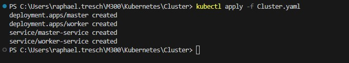
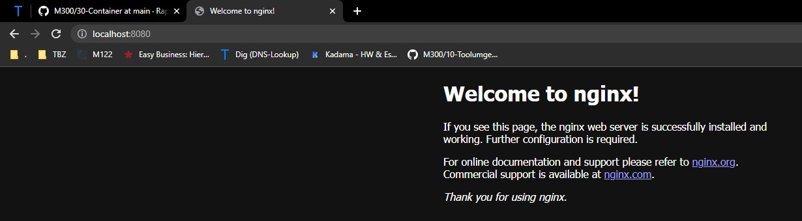
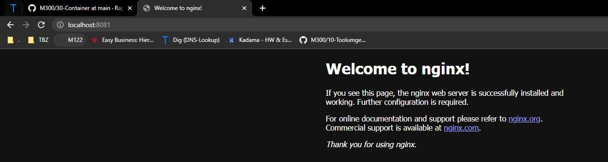

### Cluster in Kubernetes

Die vorliegende YAML-Datei enthält eine Konfiguration für ein Kubernetes-Cluster mit einem "master"-Pod und zwei "worker"-Pods, die das nginx-Image verwenden. Jeder Pod lauscht auf Port 80 und hat spezifische CPU- und RAM-Ressourcenlimits. Zusätzlich gibt es zwei Services, den "master-service" und den "worker-service", die vom Typ ClusterIP sind und auf Port 80 hören. Der "master-service" ist mit dem "master"-Pod verbunden, während der "worker-service" mit den "worker"-Pods verbunden ist.

### Konfiguration des Kubernetes-Clusters
Die YAML-Datei definiert die Konfiguration für das Kubernetes-Deployment des Clusters mit den folgenden Elementen:

Deployment: Es wird ein "master"-Pod und zwei "worker"-Pods erstellt, die das nginx-Image verwenden. Jeder Pod ist auf Port 80 eingestellt und hat spezifische CPU- und RAM-Ressourcenlimits.
Services: Es werden zwei Services erstellt, der "master-service" und der "worker-service". Beide Services sind vom Typ ClusterIP und hören auf Port 80. Der "master-service" ist mit dem "master"-Pod verbunden, während der "worker-service" mit den "worker"-Pods verbunden ist.
Durch die Verwendung dieser YAML-Datei wird das Kubernetes-Cluster mit einem "master"-Pod und zwei "worker"-Pods erstellt, die das nginx-Image verwenden. Jeder Pod ist über Port 80 erreichbar und hat spezifische Ressourcenlimits. Die Services ermöglichen die Kommunikation mit den entsprechenden Pods im Cluster, wobei der "master-service" mit dem "master"-Pod und der "worker-service" mit den "worker"-Pods verbunden ist.

### Ablauf Installation
## Erstelle Kubernetes Cluster

```Script
kubectl apply -f Cluster.yaml
```

## Löschen von Cubernet Cluster

```Script
kubectl delete -f Cluster.yaml
```


### Kontrolle

Um den Cluster zu testen machen wir noch ein Port-Forwarding
```Script
kubectl port-forward service/master-service 8080:80  
kubectl port-forward service/worker-service 8081:80   
```



### Testprotokoll
| Nr | Testfall | Erwartetes Ergebnis | Tatsägchliches Ergebnis | Abgenommen? |
| -------- | -------- | -------- | -------- | -------- |
| 1 | Funktionalität | Nach ausführen von dem .yaml file ist dies in Docker ersichtlich | Es ist alles ersichtlich  | Ja |
| 2 | Funktionalität | Website ist unter http://localhost:8080 erreichbar | Ist erreichbar | Ja |
| 3 | Funktionalität | Website ist unter http://localhost:8081 erreichbar  | Ist erreichbar | Ja |
| 4 | Replizierbarkeit | Gleiches file kann auf meinem Privaten PC gestartet werden | Wird auf Privatem PC gestartet | Ja |